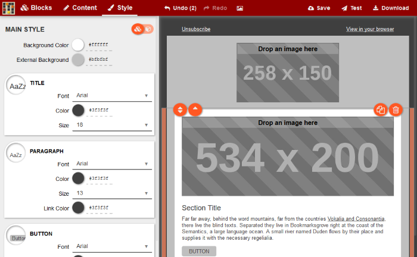

# Mosaico - Responsive Email Template Editor with Codeigniter Backend

Mosaico is a JavaScript library (or maybe a single page application) supporting the editing of email templates. The great thing is that Mosaico itself does not define what you can edit or what styles you can change: this is defined by the template. This makes Mosaico very flexible.



This Backend implementation of Mosaico comes with the latest version of Codeigniter and Codeigniter Ion Auth 2. Moreover, I've also integrated an [Email Queue System](https://github.com/izn/codeigniter-mailqueue/) for sending bulk Email. The library is just an extension to Codeigniter's built-in Email Class, therefore it can be omitted from the project, if desired, in which case `line number 423` and `send_pending_emails` method from the **Email_templates** Controller.

*********************
# Server Requirements
*********************

PHP version 5.6 or newer is recommended.

It should work on 5.3.7 as well, but we strongly advise you NOT to run
such old versions of PHP, because of potential security and performance
issues, as well as missing features.

Install and Enable `Imagick` PHP Extension (to be used in Mosaico Image Placeholders), `PHP Cli and exec()` (to be used in [Email Queue System](https://github.com/izn/codeigniter-mailqueue/)).

**************
# Installation
**************

Please make sure that your server fulfills the above mentioned Requirements, then see the [installation section](https://codeigniter.com/user_guide/installation/index.html) of the CodeIgniter User Guide.

Then import database from `mosaico_ci.sql` [file](https://github.com/ar27111994/Mosaico-CodeIgniter-Ion-Auth/blob/master/mosaico_ci.sql).

Plus, You need NodeJS v6.0 or higher + ImageMagick

this may raise warnings about Knockout, ignore them. It will probably fail on some colorpicker dependency, just run it again and will work:
```
  npm install
```
if you don't have it, install grunt-cli globally
```
  npm install -g grunt-cli
```
compile and run a local webserver (http://127.0.0.1:9006) with incremental build and livereload
```
  grunt
```
*IMPORTANT* in order to use image uploading/processing feature in Node you need imageMagick installed in your environment.
e.g. running "convert" and "identify" on the command line should output imageMagick command line help (if you are on Windows and install imageMagick 7.x then make sure to install ["legacy utilities"](https://github.com/aheckmann/gm/issues/559)).

If you create your own template you can generate the needed "thumbnails"/"block thumbnails" by running:
```
grunt makeThumbs:main:yourtemplatename
```

*NOTE* we have reports that default Ubuntu node package have issues with building Mosaico via Grunt. If you see a ```Fatal error: watch ENOSPC``` then have a look at https://github.com/voidlabs/mosaico/issues/82

*********
# License
*********

Please see the [license agreement](https://github.com/ar27111994/Mosaico-CodeIgniter-Ion-Auth/blob/master/LICENSE).

***********
# Resources
***********

- [Codeigniter User Guide](https://codeigniter.com/docs>)
- [Codeigniter Language File Translations](<https://github.com/bcit-ci/codeigniter3-translations)
- [Codeigniter Community Forums](http://forum.codeigniter.com/)
- [Codeigniter Community Wiki](https://github.com/bcit-ci/CodeIgniter/wiki)
- [Codeigniter Community IRC](https://webchat.freenode.net/?channels=%23codeigniter)
- [Mosaico Basics](https://github.com/voidlabs/mosaico/wiki)
- [Mosaico Developer Notes](https://github.com/voidlabs/mosaico/wiki/Developers)

Report security issues to our `Admin <mailto:admin@ar27111994.com>`_, thank you.

*****************
# Acknowledgement
*****************

The Mosaico CodeIgniter Ion Auth team would like to thank EllisLab, Voidlabs all the
contributors to the CodeIgniter, Ion Auth, Mosaico projects and you, the Mosaico CodeIgniter Ion Auth user. Moreover, Special thanks to:

- [Thaynã Bruno Moretti](https://github.com/izn/codeigniter-mailqueue/)
- [Access Interpreting, Inc.](https://github.com/ainterpreting/mosaico-php-backend)
- [markalston](https://github.com/markalston/mosaico-php-backend)
- [JbalTero](https://github.com/JbalTero)
- [Chris McGrane](https://github.com/notchris/mosaico)
- [Matt G.](https://github.com/mattghall/mosaico-mattg)
- [Bernhard Weichel](https://github.com/bwl21/mosaico-php-backend)

### Contact Us

Please contact us if you have ideas, suggestions or, even better, you want to collaborate on this project or you need COMMERCIAL support: ar27111994@gmail.com . Please DON'T write to this email to get free support: use Git issues for that.
